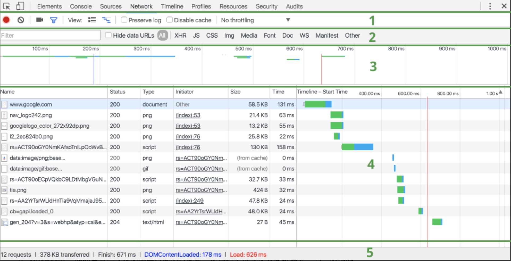
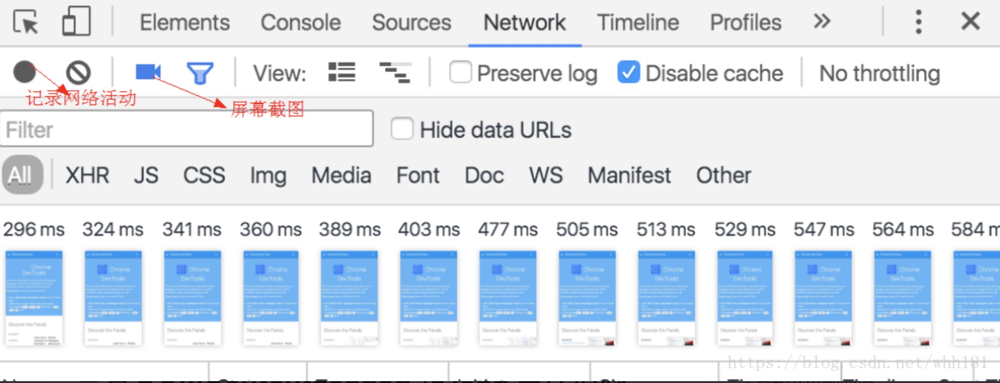
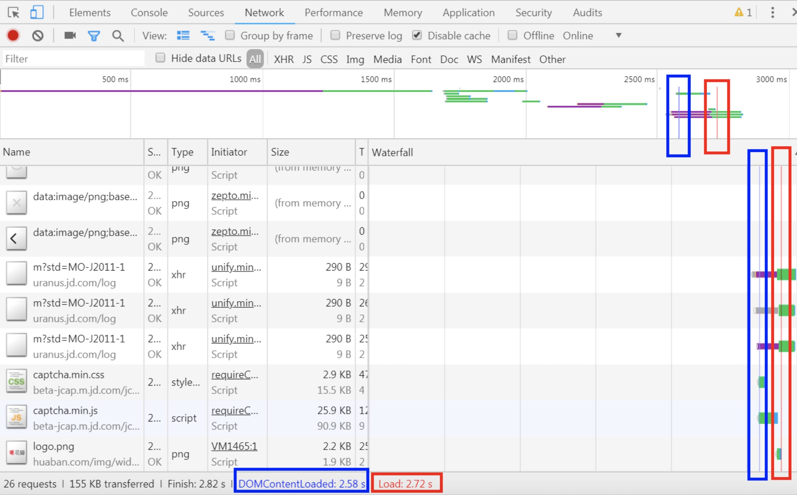
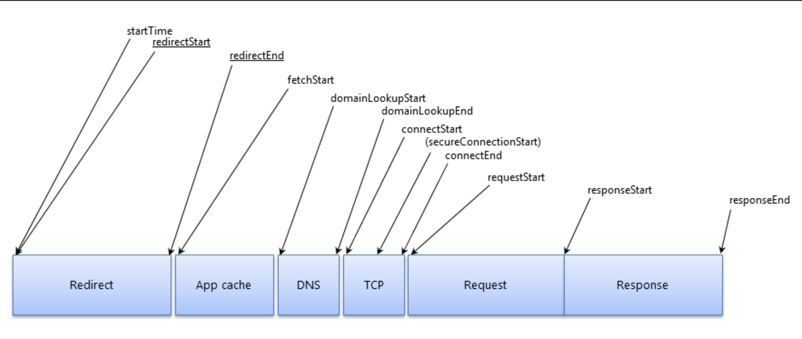
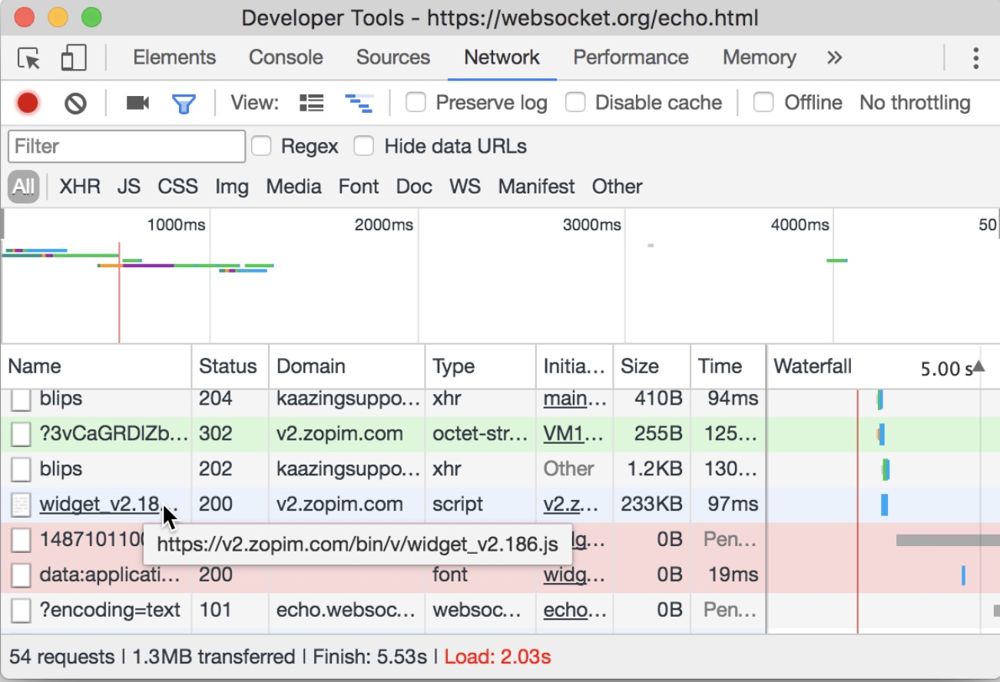

## **`Chrome DevTools`之`Network`**

- 空格键翻页
- 左右键切换页面，上下键翻章节
- esc 章节预览

<hor />
### Network 面板概览

<ver />

<ver />
1. `Controls`**工具栏**使用这些选项可以控制 `Network` 面板的外观和功能。
2. `Filters`**筛选栏**使用这些选项可以控制在 `Requests Table `中显示哪些资源。**提示：按住 `Cmd (Mac)` 或 `Ctrl (Windows/Linux)` 并点击过滤器可以同时选择多个过滤器。**
3. `Overview` **概览**资源被加载过来的时间线，如果多条时间线垂直堆叠，表示多个资源被并行加载。

<ver />
4. `Requests Table`**请求列表**该视窗列出了所有的资源请求，默认按时间顺序排序，点击某个资源，可以查看更详细的信息。 **提示：右键点击 Timeline 以外的任何一个表格标题可以添加或移除信息列。**
5. `Summary`**总览** 显示总的请求数、数据传输量、加载时间信息。

<ver />
默认情况下，Request Table 请求列表展示如下信息，当然，在请求列表的表头右键可以配置请求列表显示的内容。
- **Name：**资源的名称。
- **Status：**HTTP的状态码。
- **Type**：资源的MIME类型。
- **Initiator：**表示请求的上游，即发起者。Parser表示是HTML解析器发起的请求；Redirect表示是HTTP跳转发起的请求；Script表示是由脚本发起的请求；Other表示是由其他动作发起的请求，比如用户跳转或者在导航栏输入地址等。
- **Size：**请求的大小，包括响应头和响应体的内容。
- **Time：**请求的时间，从请求开始到请求完全结束。
- **Timeline：**请求的时间线。

<hor />

#### 记录网络活动与屏幕截图

<ver />

记录网络活动：显示红色 (记录按钮打开) 表明 DevTools 正在记录。 显示灰色 (记录按钮关闭) 表明 DevTools 未在记录。

<ver />

<hor />

#### 查看 `DOMContentLoaded` 和 `load` 事件信息

<ver />

- 页面文档完全加载并解析完毕之后，会触发DOMContentLoaded事件，它在两个地方都有体现：概览视窗的蓝色竖线，总览视窗的触发时间。
- 当所有资源加载完成后触发的，它在三个地方有体现：概览视窗的红色竖线，请求列表视窗的红色竖线，总览视窗的触发时间。

<ver />

<hor />

### 查看单个资源的详细信息

<ver />

#### `查看 HTTP 标头`

Headers 标签可以显示资源的请求网址、HTTP 方法以及响应状态代码。 此外，该标签还会列出 HTTP 响应和请求标头、它们的值以及任何查询字符串参数

<ver />

#### `预览资源`

点击 Preview 标签可以查看该资源的预览。Preview 标签可能显示一些有用的信息，也可能不显示，具体取决于您所选择资源的类型

<ver />

#### `查看 HTTP 响应内容`

点击 Response 标签可以查看资源未格式化的 HTTP 响应内容。 Preview 标签可能包含一些有用的信息，也可能不包含，具体取决于您所选择资源的类型。

<ver />

#### `查看网络耗时`

点击 Timing 标签可以查看单个资源请求生命周期的精细分解。
生命周期按照以下类别显示花费的时间：

Queuing
Stalled
如果适用：DNS lookup、initial connection、SSL handshake
Request sent
Waiting (TTFB)
Content Download

<ver />

如果网络异常更加详细的各流程耗时这一点很重要

<hor />

#### 查看 Cookie

点击 Cookies 标签可以查看在资源的 HTTP 请求和响应标头中传输的 Cookie 表。 只有传输 Cookie 时，此标签才可用

<hor />

#### 查看 WebSocket 框架

点击 Frames 标签可以查看 WebSocket 连接信息。只有选定资源发起 WebSocket 连接时，此标签才会显示

<hor />
#### 查看资源发起者和依赖项
**按住 Shift 并将鼠标悬停在资源上**按时shift键，鼠标hover在请求上，可以查看请求的上游和下游，如下图所示，hover在common.js上，可以看到有一个绿色请求、一个红色请求。其中绿色请求表示common.js的上游请求，即谁触发了common.js请求，红色请求表示common.js的下游请求，即common.js又触发了什么请求。

<ver />

<ver />

#### 对请求列表排序
请求列表的资源默认是按照起始时间排序，最上面的请求最先发起。点击表头的Timeline可以重新排序，主要有如下几个维度。
- Timline - Start Time：按请求的发起时间排序。
- Timline - Response Time：按请求的响应时间排序。
- Timline - End Time：按请求的结束时间排序。
- Timline - Total Duration：按请求的总耗时排序，可以快捷的找出耗时最多的资源。
- Timline - Latency：按请求的延迟排序，延迟是指请求发起的时间到响应开始的时间，可以快捷的找出请求等待时间最长（TTFB）的资源。

<ver />

<hor />

#### 调试技巧

<ver />

Network 面板中的 initiator 列显示了是哪个脚本的哪一行触发了请求。他显示了在调用堆栈中触发请求的最后一步，除非你用的是，例如：一个本地化的 fetch API,它将会指向一些低层级的类库的代码.
<ver />

<ver />

在请求表中，你可以看到有关每个请求的几条信息，例如：Status, Type, Initiator, Size 和 Time 。
<ver />

<ver />
Network 面板中的过滤器输入可以接受你输入的字符串或正则表达式，仅显示匹配的请求。 
- domain：筛选出指定域名的请求，不仅支持自动补全，还支持*匹配。
- has-response-header：筛选出包含指定响应头的请求。
- is：通过is:running找出WebSocket请求。
- larger-than：筛选出请求大于指定字节大小的请求，其中1000表示1k。
- method：筛选出指定HTTP方法的请求，比如GET请求、POST请求等。
- mime-type：筛选出指定文件类型的请求。
cc

